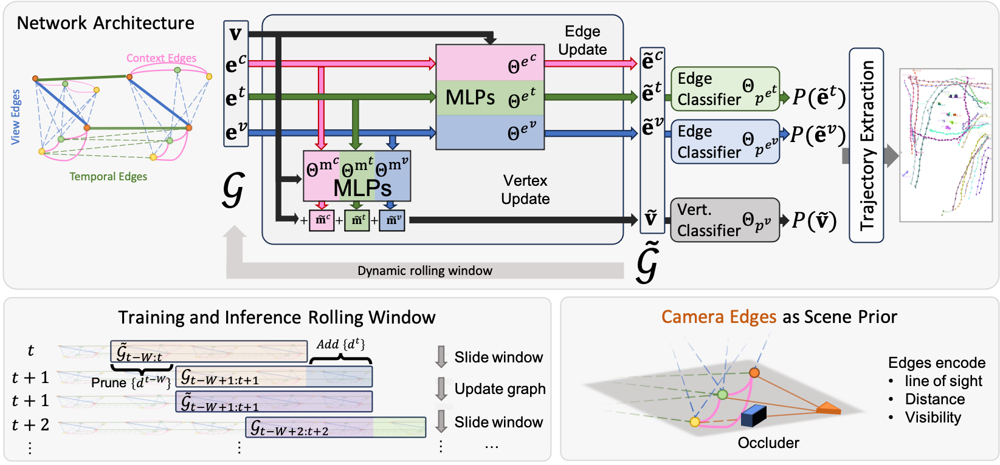

# Unified People Tracking with Graph Neural Networks




📄 [Paper](https://arxiv.org/abs/your-paper-id) | 🏟️ [Scout Dataset](https://scout.epfl.ch/) | 🛠️ [Scout Dataset Toolkit](https://github.com/cvlab-epfl/scout_toolkit)


This repository contains the implementation of a unified people tracking system using Graph Neural Networks (GNNs). The system performs multi-object tracking across multiple camera views using heterogeneous graphs with detection nodes and temporal, view, and social edges.


### Key Features

- **Unified framework**: Single model handles both monocular and multi-view scenarios
- **Online tracking**: Tracks people in real-time
- **Graph-based representation**: Flexible graph structure adapts to varying numbers of detections and cameras


## Installation

First, install the basic requirements:

```bash
pip install -r setup/requirements.txt
```

We also provide a complete environment file for the project:

```bash
conda env create -f environment.yml
```

## Dataset

### Supported Datasets

The system supports the following datasets:
- **Wildtrack**: Multi-view pedestrian tracking dataset ([download](https://www.epfl.ch/labs/cvlab/data/data-wildtrack/))
- **MOT17**: Monocular multi-object tracking dataset (train/test splits) ([download](https://motchallenge.net/data/MOT17/))
- **MOT20**: Monocular multi-object tracking dataset (train/test splits) ([download](https://motchallenge.net/data/MOT20/))
- **Scout**: Monocular and multi-view tracking dataset (train/val/mono splits) ([download](https://scout.epfl.ch/))

### Dataset Setup

1. **Update dataset paths**: Edit `configs/pathes.py` to point to your dataset locations:

```python
data_path = {
    'wildtrack_root': Path('/path/to/wildtrack/'),
    'scout_root': Path('/path/to/scout/'),
    'MOT17_root': Path('/path/to/MOT17/'),
    'MOT20_root': Path('/path/to/MOT20/'),
}
```

2. **Download precomputed detections** (recommended for faster setup):

```bash
# Download all precomputed detections
bash setup/download_all_preextracted_detections.sh

# Or download specific datasets
python setup/download_detection_archives.py wildtrack
python setup/download_detection_archives.py mot17
python setup/download_detection_archives.py mot20
python setup/download_detection_archives.py scout
```

For more details about detection management, see [setup/README_detections.md](setup/README_detections.md).

<details>
<summary>Running detectors yourself (not recommended)</summary>

### Running detectors (not recommended)

If you prefer to run the detectors yourself instead of using the precomputed detections, follow these steps:

1. **Install extended requirements**:

   ```bash
   pip install -r setup/extended_requirements.txt
   ```

2. **Note**:  
   `mmcv` might conflict with the `torch scatter` library. If you encounter issues, temporarily comment out the import in `model/factory.py` while the detectors are running.

3. **Download pretrained detectors** (required for running detectors):

   ```bash
   bash setup/download_pretrained_detectors.sh
   ```

   Those detectors are coming from the mmdetection repository. More information about the detectors can be found [here](https://github.com/open-mmlab/mmdetection).

</details>


## Training

### Basic Training Commands

**Wildtrack**:
```bash
python train.py -cfg configs/files/config_wildtrack.yaml -ftr bbox,true,512 world_points,true,64 timestamp,true,64 view_id,true,64 -ov 5 -udv -dt mvaug_ground -fmgt -ws 10 -tmd 4 -vemd 50.0 -tms 150.0 -der 0.1 -n train_wildtrack
```

**MOT17**:
```bash
python train_amp.py -cfg configs/files/config_mot_17.yaml -ftr bbox,true,512 confidence,true,64 timestamp,true,64 -ov 40 -aug -udt -udv -dt yolox_ghost -dth 0.05 -fmgt -ws 12 -tmd 9 -tms 50.0 -tets bbox -der 0.1 -mnfr 0.05 -n train_mot17
```

**MOT20**:
```bash
python train_amp.py -cfg configs/files/config_mot_20.yaml -cfg configs/files/config_mot_20.yaml  -ftr bbox,true,200 confidence,true,50 timestamp,true,50 -cs 20 -ov 20 -aug -udt -udv -dt yolox_ghost -dth 0.05 -fmgt -ws 10 -tmd 4 -tms 50.0 -tets bbox -der 0.1 -mnfr 0.05 -n train_mot20
```

**Scout Mono**:
```bash
python train_amp.py -cfg configs/files/config_scout_mono.yaml -cfg configs/files/config_scout_mono.yaml  -ftr bbox,true,512 confidence,true,64 timestamp,true,64 -ov 5 -aug -udt -udv -dt yolox -dth 0.05 -fmgt -ws 10 -tmd 4 -tms 50.0 -tets bbox -der 0.1 -mnfr 0.05 -n train_scout_mono
```

**Scout Multi-View**:
```bash
python train_amp.py -cfg configs/files/config_scout.yaml -cfg configs/files/config_scout.yaml  -ftr bbox,true,128 world_points,true,32 timestamp,true,32 view_id,true,32 -ov 5 -aug -udt -udv -dt yolox -dth 0.05 -fmgt -ws 10 -tmd 4 -vemd 50.0 -tms 150.0 -der 0.1  -n train_scout_multi_view
```

**Scout Multi-View with Scene Prior**:
```bash
python train_amp.py -cfg configs/files/config_scout.yaml -cfg configs/files/config_scout.yaml  -ftr bbox,true,128 world_points,true,32 timestamp,true,32 view_id,true,32 -ov 5 -aug -udt -udv -dt yolox -dth 0.05 -fmgt -ws 10 -tmd 4 -vemd 50.0 -tms 150.0 -der 0.1 -ucn -cef occlusions,False,3 zeros,False,1 -n train_scout_multi_view_scene_prior
```

### Training Scripts

- `train.py`: Standard training script
- `train_amp.py`: Training with Automatic Mixed Precision (AMP) for faster training and larger graphs.

### Key Training Arguments

- `-cfg`: Configuration file path
- `-ftr`: Feature specifications (format: `feature_type,normalized,hidden_size`)
- `-n`: Model name
- `-lr`: Learning rate (default: 0.0001)
- `-max_epoch`: Maximum epochs (default: 200)
- `-bs`: Batch size (default: 1)
- `-aug`: Enable data augmentation
- `-udt`: Use detections for training
- `-dt`: Detection type (yolox, rtmdet, etc.)

For detailed training options, see the extensive argument list in `configs/arguments.py`.

## Evaluation

### Download Pretrained Models

```bash
bash setup/download_checkpoints.sh
```

This downloads:
- `weights/best_wildtrack.pth.tar`
- `weights/best_mot17.pth.tar`
- `weights/best_mot20.pth.tar`

### Evaluation Commands

### Wildtrack:

```
python eval.py -ckp ./weights/best_wildtrack.pth.tar -cfg configs/files/config_wildtrack.yaml -ftr bbox,true,512 world_points,true,64 timestamp,true,64 view_id,true,64 -ov 5 -udv -dt mvaug_ground -fmgt -ws 10 -tmd 4 -vemd 50.0 -tms 150.0 -der 0.1 -n eval_wildtrack
```

### MOT17:

```
python eval_amp.py -ckp ./weights/best_mot17.pth.tar -cfg configs/files/config_mot_17.yaml -ftr bbox,true,512 confidence,true,64 timestamp,true,64 -ov 40 -aug -udt -udv -dt yolox_ghost -dth 0.05 -fmgt -ws 12 -tmd 9 -tms 50.0 -tets bbox -der 0.1 -mnfr 0.05 -n eval_mot17
```

### MOT20:

```
python eval_amp.py -ckp ./weights/best_mot20.pth.tar -cfg configs/files/config_mot_20.yaml  -ftr bbox,true,200 confidence,true,50 timestamp,true,50 -cs 20 -ov 20 -aug -udt -udv -dt yolox_ghost -dth 0.05 -fmgt -ws 10 -tmd 4 -tms 50.0 -tets bbox -der 0.1 -mnfr 0.05 -n eval_mot20
```

### Scout Mono:

```
python eval_amp.py -ckp ./weights/best_scout_mono.pth.tar -cfg configs/files/config_scout_mono.yaml  -ftr bbox,true,512 confidence,true,64 timestamp,true,64 -ov 5 -aug -udt -udv -dt yolox -dth 0.05 -fmgt -ws 10 -tmd 4 -tms 50.0 -tets bbox -der 0.1 -mnfr 0.05 -n eval_scout_mono
```

### Scout Multi-View:

```
python eval_amp.py -ckp ./weights/best_scout_multi_view.pth.tar -cfg configs/files/config_scout.yaml  -ftr bbox,true,128 world_points,true,32 timestamp,true,32 view_id,true,32 -ov 5 -aug -udt -udv -dt yolox -dth 0.05 -fmgt -ws 10 -tmd 4 -vemd 50.0 -tms 150.0 -der 0.1 -n eval_scout_multi_view
```

### Oracle Evaluation

Run baseline evaluations with oracle information:

```bash
# Oracle with ground truth edges
python train.py ...other arguments... -uo -ort graph_edges -n oracle_eval

# Oracle with ByteTrack
python train.py ...other arguments... -uo -ort bytetrack -n oracle_bytetrack
```

### Key Evaluation Arguments

- `-ckp`: Checkpoint path
- `-cfg`: Configuration file
- `-uo`: Use oracle mode (Use for baseline evaluation)
- `-ort`: Oracle type (graph_edges, bytetrack, sort, etc.)
- `-udv`: Use detections for evaluation
- `-dt`: Detection type
- `-dth`: Detection threshold
- `-gvis`: Generate visualizations
- `-gvid`: Generate videos

## Citation

If you use this code in your research, please cite our paper:

```bibtex
@article{engilberge25scout,
  title = {Unified People Tracking with Graph Neural Networks},
  author = {Martin Engilberge and Ivan Vrkic and Friedrich Wilke Grosche 
            and Julien Pilet and Engin Turetken and Pascal Fua},
  journal = {Arxiv},
  year = {2025}
}
```

